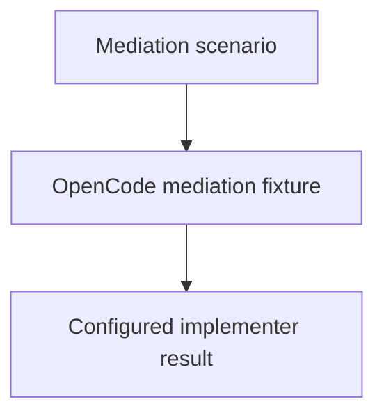

# OpenCode Mediation Dogfood

## Purpose

Provide a fresh harmless child component proving that explicit primary-agent
mediation reaches the configured implementer.

## Diagram

## Links

- `changelog.md` — concise completed-task history.
