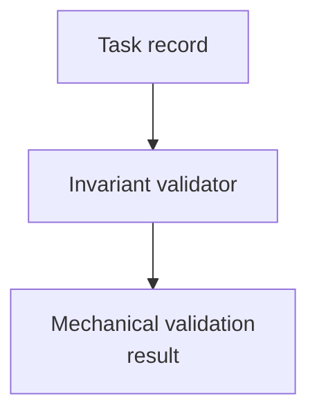

# task-record-validator-reference - as-is

## Purpose

Retain the Python task-record validator and compatibility tests as bounded,
non-runtime reference evidence for the canonical Bun task-control validator.
This fixture is not a task authority, runtime validator owner, or component.

## Design

The fixture retains mechanical compatibility evidence for task-record invariant
checks. The canonical TypeScript implementation and focused Bun tests remain
under the task-control family; this directory contains only the Python
reference and its focused compatibility test.

**Lineage**: [as-is](../../as-is.md#design) / [Validation Fixtures](../as-is.md#design) / **task-record-validator-reference**

### Task-record invariant validation

- Validate task-record invariants independently of host-specific runtime
  enforcement.
- Retain compatibility evidence without becoming task authority or runtime
  enforcement.
- [`../../core/modules/task-control/task-record-validator.ts`](../../core/modules/task-control/task-record-validator.ts)
  provides the canonical dependency-free Bun/TypeScript validator.
- [`../../core/modules/task-control/task-record-validator.test.ts`](../../core/modules/task-control/task-record-validator.test.ts)
  provides focused Bun coverage; [`task_record_validator.py`](task_record_validator.py)
  and its Python test remain non-runtime reference evidence and a compatibility
  check.
